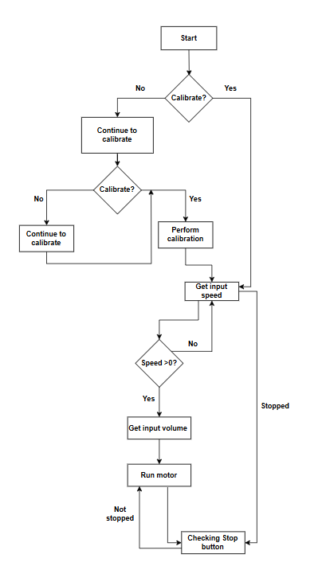
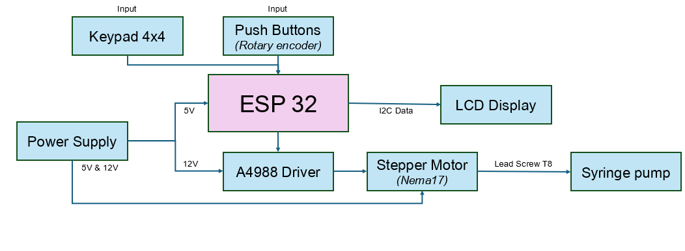
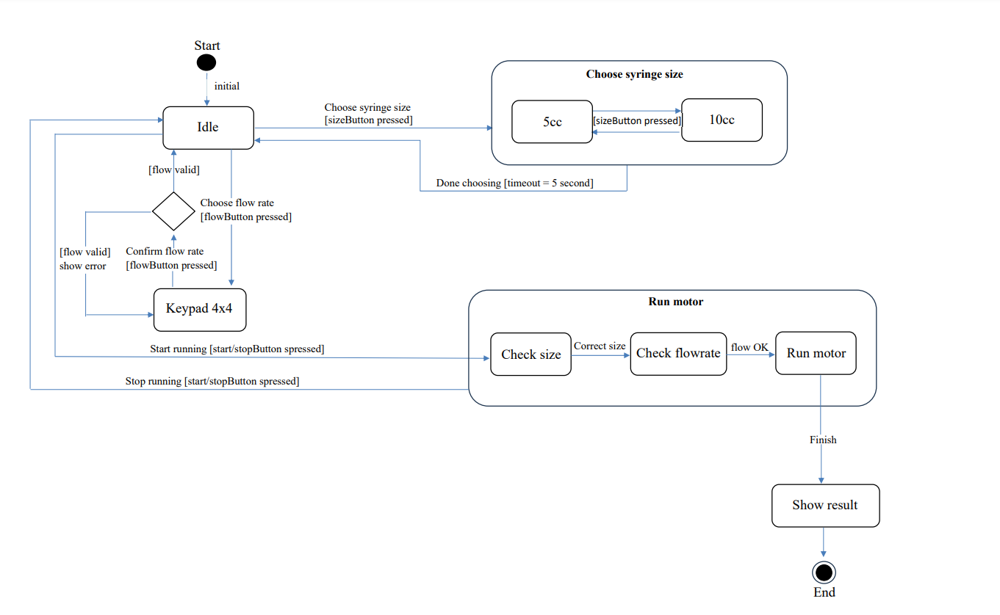

# Final Project: Syringe Pump
## Team Members
[ Nguyen Huynh trong Hieu - BEBEIU21007] 
[ Huynh Doan The Bao - BEBEIU21190]
[ Tran Tri Cuong - BEBEIU21198]
[ Nguyen Ngoc Uyen Nhi - BEBEIU22187]
## Introduction
A syringe pump has been developed to control the volume and flow rate of a liquid or a solution. The syringe pump is fabricated by controlling the speed and pulse width modulation (PWM) of stepper motors based on the ESP32v microcontroller board. Syringe pumps are commonly used in research and medical applications where precise fluid handling is required, such as drug delivery, laboratory experiments, and chemical analysis.
## Objective
The primary objectives of a syringe pump include: Precision Fluid Dispensing, Controlled Flow Rate, Accurate Volume Control, Long-duration Operation, Versatility in Applications. Overall, the syringe pump serves as a critical tool in laboratories and clinical settings where precise, controlled fluid movement is necessary.
## Flow Chart

## Block Diagram

## State Diagram
